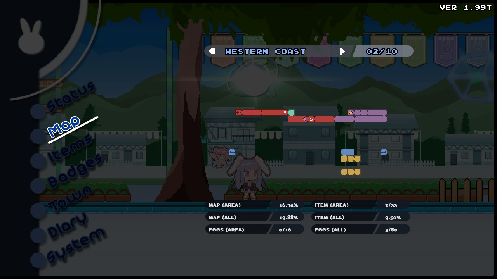
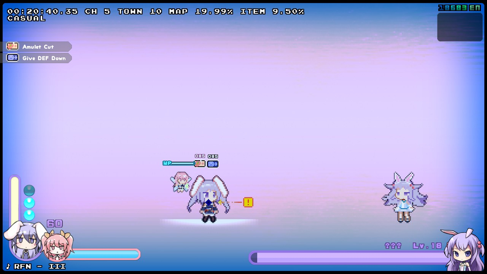

# ゲーム内 Speedrun 関連情報

 

## 基本知識

+ タイムは PLAYTIME を用いて計測される。
  + このため何度でもリトライして良い記録を作れる。
    + ただしロード後は速度がゼロになってしまうため、移動ではロスが発生する。
  + セーブのファイル選択時でもタイムは止まらない。
    + 基本的にマップ内のオートセーブに頼るべき。
  + PLAYTIME 準拠であることを悪用してあらゆる壁で Buffered Wall Launch を使用して微短縮を狙える。

 

## Speedrun 実績関連情報

+ New Game + でも取得可能。
  + Alternative ではストーリー進行ペナルティもリセットされるため (実装し忘れ？) 、雑にプレイするだけでも取得可能。
    + Standard では Loop 2 以降では全てのストーリー進行ペナルティが最初から加算されている。

### 設定タイム (分)

| 難易度 | Platinum | Gold | Silver | Bronze |
| :---: | ---: | ---: | ---: | ---: |
| CASUAL | 60 | 72 | 84 | 96 |
| NOVICE | 70 | 84 | 98 | 112 |
| NORMAL | 80 | 96 | 112 | 128 |
| HARD | 90 | 108 | 126 | 144 |
| HELL | 100 | 120 | 140 | 160 |
| BEX | 110 | 132 | 154 | 176 |
| UNKNOWN | 120 | 144 | 168 | 192 |
| IMPOSSIBLE | 130 | 156 | 182 | 208 |
| X-BUNNY | 160 | 192 | 224 | 256 |

 

## Steam Leaderboard Speedrun 関連情報

実績の Speedrun とは違い、細かいルールが存在する。
+ `Border` より早いタイムの場合はデータの審査が行われ、全ての要件を満たしたときスコアが送信される。
+ 要件 : 
  + ボスを撃破してランク表示された回数が要求数以上。
    
    + Strike Zip を用いるルートではこの項目で審査落ちする。
  + ボスおよび中ボスとの戦闘時間が `Boss Time` 以上。
    + この時間は破数を元に計算されているのでボス撃破数が多くなれば閾値も上がる。
    + Main Game Any% - Casual を Miru ルートで通した場合、この項目で審査落ちする可能性がある。
  + マップ踏破率が 20.00% 以上。
    + Map Transition RCS を用いると審査落ちする可能性がある。
  + タイムが `Fastest` 以上。
  + 敵に与えた総ダメージが `Damage Done` を超えている。
    + UNKNONW 以上ではこの数値も上昇する。
  + DMG TAKEN が 0 ではない。
  + Game Mode が Standard モード。
  + New Game + のデータではない。
  + Multiplayer で遊んだデータではない。 
  + その他、チートなどを使わなければ通常起こり得ない状況になったことがない。
    + en が 1 フレーム中に 18,000 en を超えるの上下を起こす。
    + 330 秒を超えるバフを所持する。
    + Chapter 0 で Charge Ring を入手する。
    + その他諸々。

 

### 設定タイム

#### Main Game Any%

+ 要求ボス撃破数 : 18

|  難易度  |     Border |  Fastest | Boss Time | Damage Done |
| :------: | ---------: | -------: | --------: | ----------: |
|  CASUAL  |   30:00.00 | 13:20.00 |   7:30.00 |      15,000 |
|  NOVICE  |   40:00.00 | 17:46.66 |   7:52.50 |      16,500 |
|  NORMAL  |   50:00.00 | 22:13.33 |   8:15.00 |      18,000 |
|   HARD   | 1:00:00.00 | 26:40.00 |   8:37.50 |      19,500 |
|   HELL   | 1:13:30.00 | 32:40.00 |   9:00.00 |      21,000 |
| BEX 以上 | 1:28:12.00 | 39:12.00 |   9:22.50 |      22,500 |

#### Main Game 0%

+ 要求ボス撃破数 : 18
+ 内部的には Main Game Any% の延長線上にあるため、難易度によってタイム設定が存在する。
  + ランキングはすべて共通。

|  難易度  |   Border |  Fastest | Boss Time | Damage Done |
| :------: | -------: | -------: | --------: | --------: |
| CASUAL | 45:00.00 | 20:00.00 | 7:30.00 | 15,000 |
| NOVICE | 60:00.00 | 26:40.00 | 7:52.50 | 16,500 |
| NORMAL | 1:15:00.00 | 33:20.00 | 8:15.00 | 18,000 |
| HARD | 1:30:00.00 | 40:00.00 | 8:37.50 | 19,500 |
| HELL | 1:50:15.00 | 49:00.00 | 9:00.00 | 21,000 |
| BEX 以上 | 2:12:18.00 | 58:48.00 | 9:22.50 | 22,500 |

#### Post Game Any% / 0%

+ 要求ボス撃破数 : 28

|  難易度  |   Border |  Fastest | Boss Time | Damage Done |
| :------: | -------: | -------: | --------: | --------: |
| CASUAL | 45:00.00 | 16:21.81 | 11:40.00 | 27,500 |
| NOVICE | 60:00.00 | 21:49.09 | 12:15.00 | 29,500 |
| NORMAL | 1:15:00.00 | 27:16.36 | 12:50.00 | 31,500 |
| HARD | 1:30:00.00 | 32:43.63 | 13:25.00 | 33,500 |
| HELL | 1:50:15.00 | 40:05.45 | 14:00.00 | 35,500 |
| BEX 以上 | 2:12:18.00 | 48:06.54 | 14:35.00 | 37,500 |

 

### Main Game Any% - Casual ルート

基本は Casual 10 TM Miru ルートを使用。
+  Map Transition RCS を使い Ashuri と Rabi Rabi Beach の大半をスキップ。
   + この時ちょっとだけ Beach のマップを埋める。
+ マップ埋めのために Air Dash 部屋は上の部屋から脱出する。
+  Rumi Donut を購入しない (`Boss Time` が 2 分前後余るため必要ない) 。
   + 同じ理由で Amulet Cut と Give DEF Down を購入する必要もおそらく無い。
+ ボス撃破数と `Boss Time` を稼ぐために Nixie と戦う。
+ Noah 3 は何度も戦い、送信可能ボーダーラインを見つける。
  + この時 Erina が画面中央にいる状態で Noah 3 を撃破するとオートセーブが入るので避けること。

 

#### ギャラリー

ただの自分の失敗記録。

##### すっかすか

 

##### 妖怪 1 足りない

