# Noah 2 雑多なメモ

情報は Rabi-Ribi ver 2.0.0 Feb に基づいた物です。

 

## 攻略方法

- Noah Skip をする。
- 0%+6 なら強運を引く、12 時間プレイしても引けないならやめる。

 

## 行動リスト

### 基本行動

- 初手は `601` 固定。

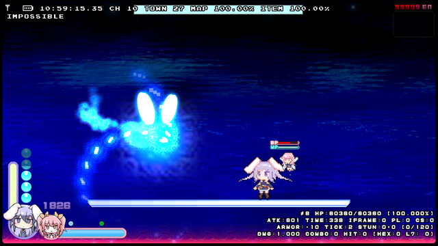

- 攻撃採用の優先度は最低だが、常に裏でカウンタが回り続けている。

| カウンタ % 15 |    ATKID    | 画像                                                         |
| :-----------: | :---------: | ------------------------------------------------------------ |
|       1       | `604, 605`  | 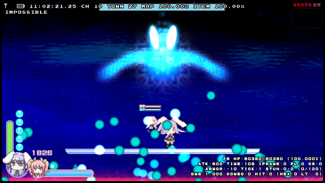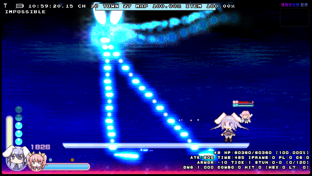 |
|       2       | `606, 607`  | 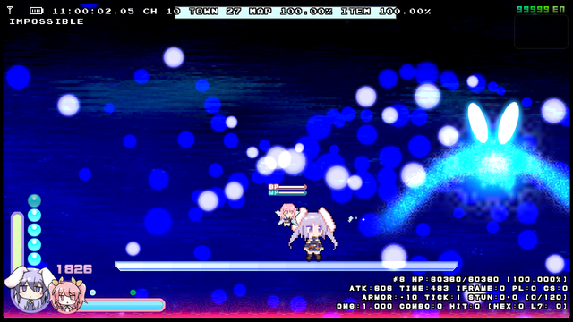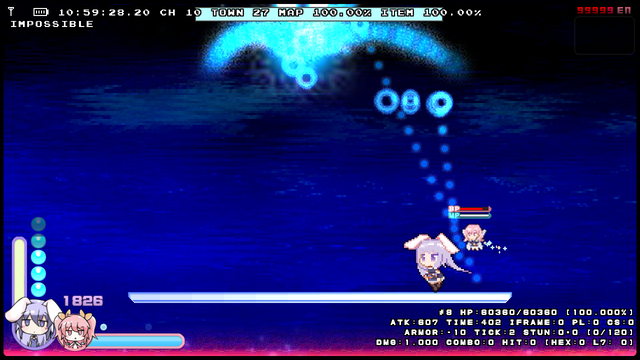 |
|       3       |    `601`    |       |
|       4       | `603, 604`  | 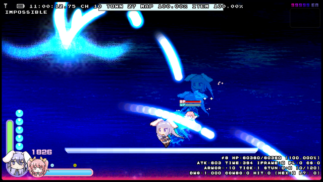 |
|       5       |    `605`    |       |
|       6       | `606, 607`  |  |
|       7       |    `606`    |       |
|       8       | `601, 602`  | 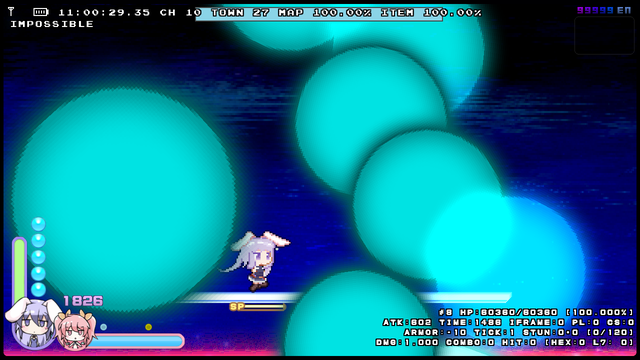 |
|       9       |    `603`    |       |
|      10       | `604, 605`  |  |
|      11       |    `602`    |       |
|      12       | `604, 605`  |  |
|      13       |    `607`    |       |
|      14       |    `601`    |       |
|       0       | `601 - 607` |  |

 

### HP < 40%

- カウンタは攻撃決定前に + 1 される

| カウンタ % 12 | ATKID | 画像                                                    |
| :-----------: | :---: | ------------------------------------------------------- |
|       1       | `614` | 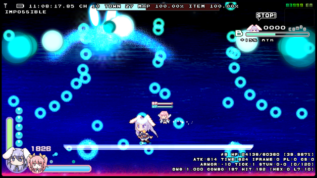 |
|       3       | `610` | 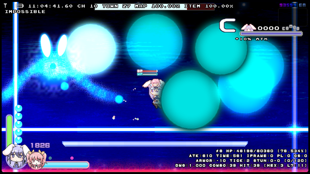 |
|       4       | `615` | 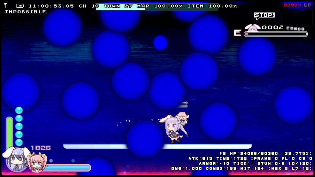 |
|       9       | `616` | 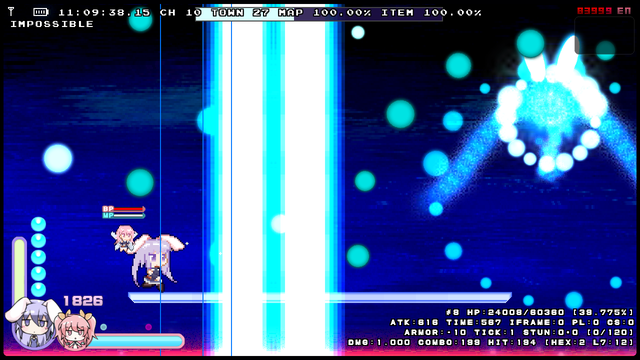 |

 

### HP < 60%

- すでに決定済みの攻撃が `610` か `614` 以上の場合、この攻撃決定処理はスキップされる。
- カウンタは攻撃決定前に + 1 される。

| カウンタ % 13 | ATKID | 画像                                                    |
| :-----------: | :---: | ------------------------------------------------------- |
|       1       | `611` | 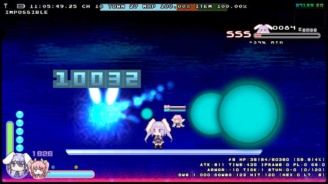 |
|       5       | `612` | 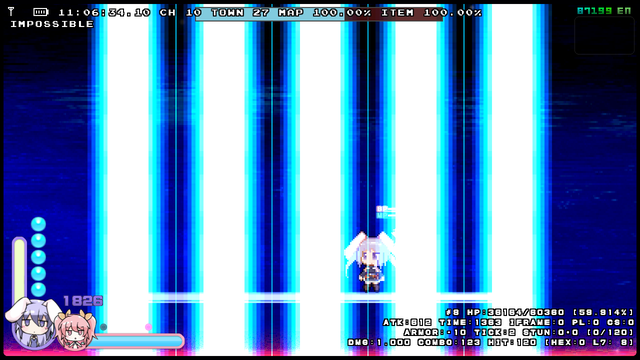 |
|     `10`      | `613` | 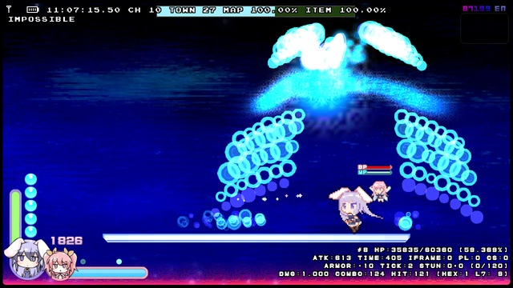 |

 

### HP < 80%

- すでに決定済みの攻撃が `610` 以上の場合、この攻撃決定処理はスキップされる。
- カウンタは攻撃決定前に + 1 される。

| カウンタ % 14 | ATKID | 画像                                                    |
| :-----------: | :---: | ------------------------------------------------------- |
|       1       | `608` | 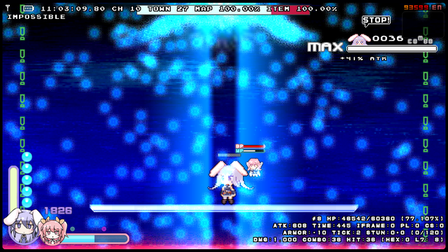 |
|       6       | `609` | 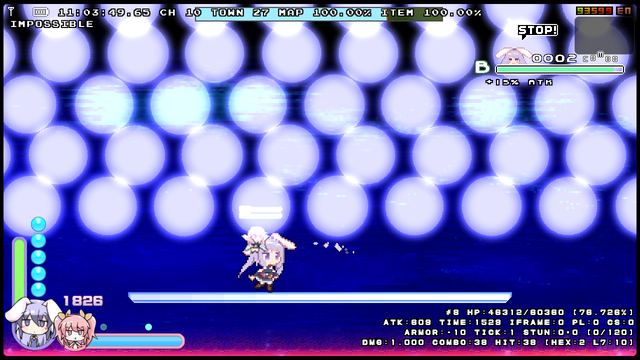 |
|     `11`      | `610` |  |

 

## 各攻撃詳細
- 一部のみ抜粋。

### 602

- 運が悪いと詰む。

### 605

- Air Jump を装備していない場合、即座にこの攻撃を終了し次の攻撃体勢に移る。
- Rabi Slippers を装備していない場合、Noah 2 の回転速度が約 1.24 倍になる。

### 606

- `ATKTIME % (77 - pow(Difficulty, 2) * 2)) == 0` の時 8 Way 自機狙い弾を発射する。
- 難易度 UNKNOWN ではプレイヤー視点で 4 フレーム毎に弾をばらまく不可避行動となる。
   - 攻撃時に移動を取らないパターンなら回避可能。
   - 0%+6 では `605` のスキップの影響でこの攻撃を散々喰らう羽目になる。

### 608

- 難易度 IMPOSSIBLE では不可避な攻撃。TAS でも回避のためには相当な乱数調整が必要だと思われる。

### 610

- スライディングでも回避可能。行動ごとに Rainbow Pellet を発射していればコンボが切れる事も無い。

### 611

- Air Jump を装備していない場合、弾の発生頻度が約 1/4 になる。
- Hitbox Down を装備している場合、棒立ちでも回避可能。

### 612

- 運が悪いと詰む。

### 614

- 単純に低速状態で移動しているだけだとラインが不足する。

 

## 当たり判定

- 一部のみ抜粋。
- 弾の hitbox の色はダメージの高さを表し、青いほど低く、赤いほど高い。
- 表示されている hitbox はドット単位で正確である事を保証できない。

### 602
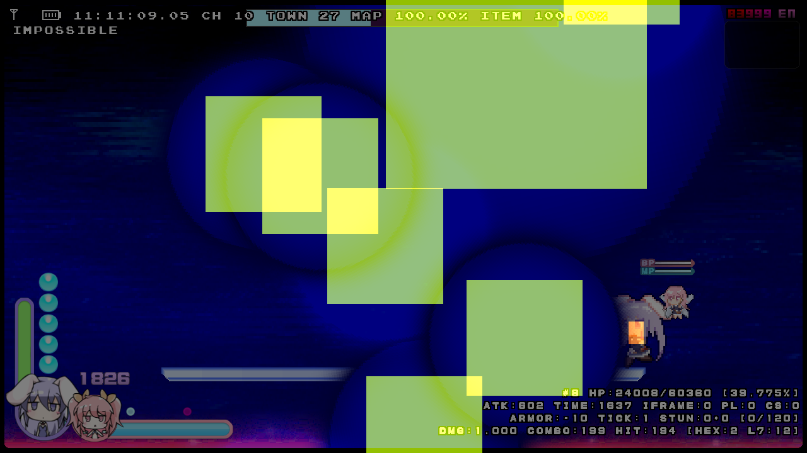

### 608
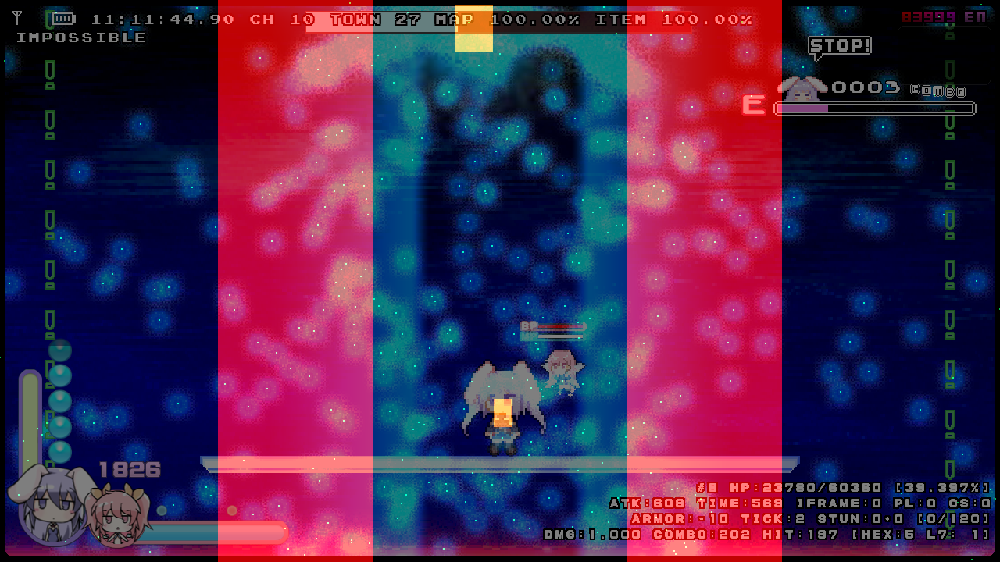

### 609
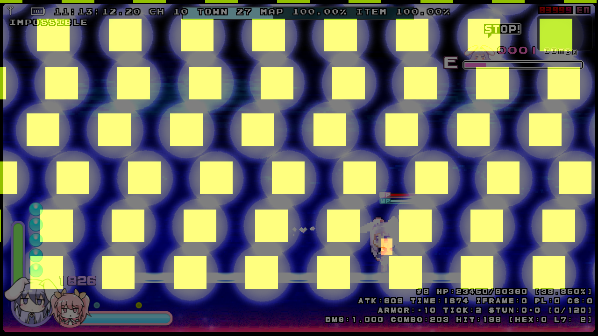

### 610

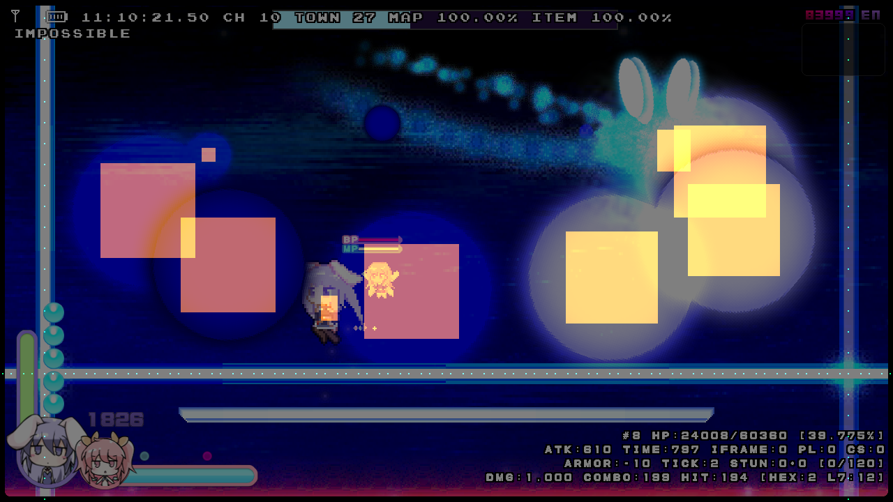

### 611

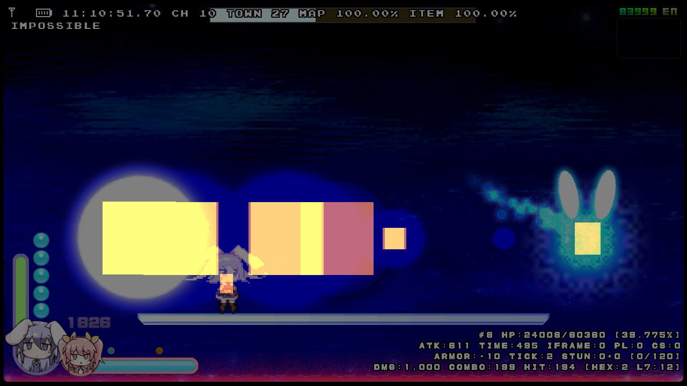

### 612
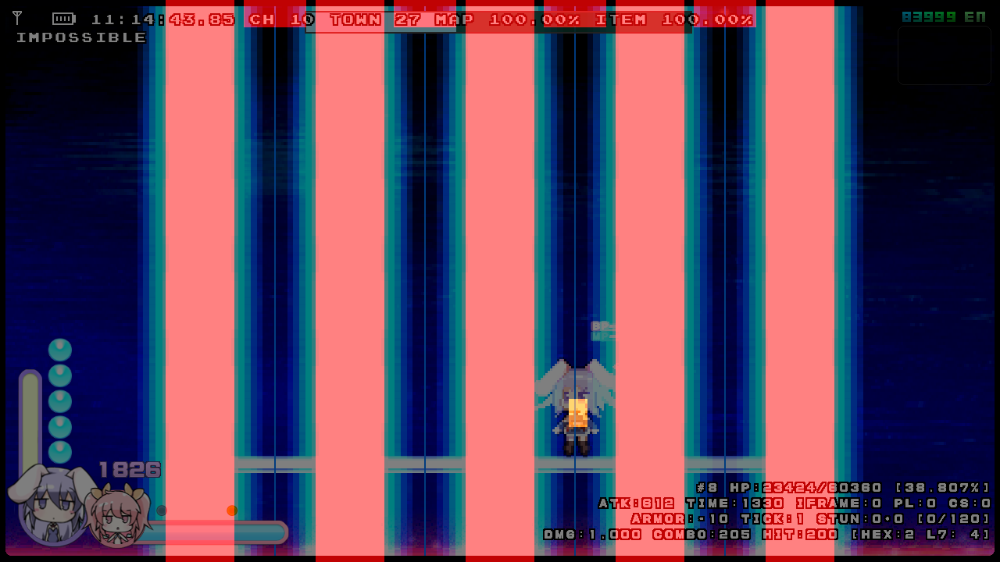

### 615
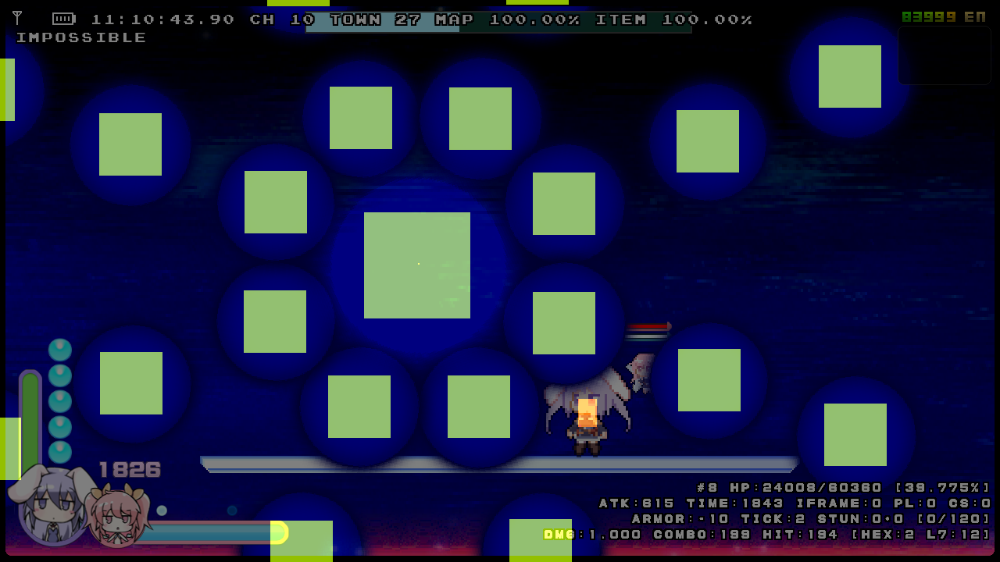

 

## その他

### メモリマップ
- Noah 2 は `EntityID = 8` 固定。
- データ型はすべて `float` 型。

| Address         | メモリ内容               | 値の範囲        |
| --------------- | ------------------------ | --------------- |
| `Entity[0x57C]` | 攻撃カウンタ `HP < 100%` | `10000 - 10014` |
| `Entity[0x584]` | 攻撃カウンタ `HP < 80%`  | `0 - 13`        |
| `Entity[0x578]` | 攻撃カウンタ `HP < 60%`  | `0 - 12`        |
| `Entity[0x580]` | 攻撃カウンタ `HP < 40%`  | `0 - 11`        |

