# Ashuri 1 攻略情報

    

## 諸注意

+ この記事は Rabi-Ribi ver 1.99t を逆アセンブルして得た情報を元に執筆しています。
  + あくまで**解析ベースの情報**ですので取り扱いには注意してください。
    + 個人的には [Rabi-Ribi ラビリビ 攻略wiki](https://w.atwiki.jp/rabi-ribi/) 等に情報の転用が行われても構いませんが、解析系の情報が苦手な方は多くいらっしゃると思いますので具体的過ぎる数値やフローを載せるのは避けたほうがいいかも…。
+ コードに対しての誤解や雑な検証が原因で誤った情報が混ざってる可能性があります。
+ ここでは「超過」という単語を「未満」の対義語として使用しています。
+ フレーム数は敵から見たもので、プレイヤーからはより少ない値となります。

 
 

## 行動速度増加量
| 難易度     |   ザコ敵 |    ボス | ボス + Speed Up |
| :---: | ---: | ---: | ---: |
| CASUAL     |   +0.00% |  +0.00% |         +16.67% |
| NOVICE     |   +0.00% |  +0.00% |         +16.67% |
| NORMAL     |   +5.00% |  +5.00% |         +16.67% |
| HARD       |   +8.33% |  +8.33% |         +25.00% |
| HELL       |  +12.50% | +12.50% |         +33.33% |
| BEX        |  +16.67% | +16.67% |         +33.33% |
| UNKNOWN    |  +25.00% | +25.00% |         +33.33% |
| IMPOSSIBLE | +100.00% | +50.00% |         +33.33% |
| X-BUNNY    | +100.00% | +50.00% |         +33.33% |

+ IMPOSSIBLE 以上の難易度になると Speed Up バフが持つリミッターによって逆に行動速度が遅くなる。
+ 上記に加えて Bunny Heaven ではプレイヤーに +50% 、 Bunny Hell では全ての敵に +133.33% の行動速度増加が追加で行われる。
  + 例えば BEX + Bunny Hell ( およそ 250% ) では CASUAL ( 100% ) の約 2.5 倍の速度で動くこととなる。
 
 

## 行動パターン

行動の記載の順番は一般的な発生順としています。 
 

### ジャンプ (ATKID : 0)

最初に確定で使用してくる行動。 
初回のジャンプの高度は固定。 
着地時にカウンタに 1 ～ 3 の整数値をランダムで足して、カウンタが 4 以上になった場合に次の行動に移る。 
ジャンプの高度とカウンタは連動しているため、高度が高いほど次の着地で攻撃態勢になる可能性が高い。 

#### ジャンプ回数の確率
| 回数 | 確率 | 確率 (%) |
| :---: | ---: | ---: |
| 2 回 | 18/27 | 66.666% |
| 3 回 | 8/27 | 29.629% |
| 4 回 | 1/27 |  3.703% |

#### ジャンプの高さとその後の行動確率

**高さ 1**

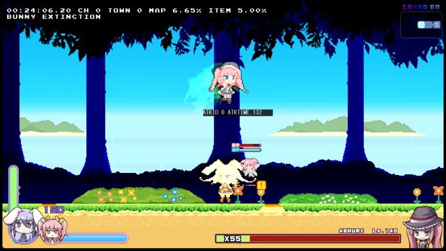

攻撃 : 33.33% ジャンプ : 66.66%

**高さ 2**

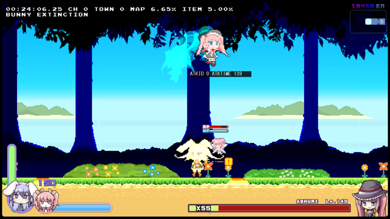

攻撃 : 66.66% ジャンプ : 33.33%

**高さ 3**

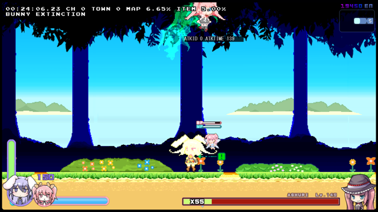

攻撃 : **100.00%**

#### 行動後パターン

| HP 割合 | 確率 | 行動 |
| :---: | ---: | :---: |
| `HP >= 80%` | 50.00% 50.00% | 赤色弾幕 水色弾幕 |
| `80% > HP >= 66%` | 50.00% 25.00% 25.00% | 赤色弾幕 水色弾幕 横レーザー |
| `66% > HP >= 60%` | 35.00% 30.00% 25.00% 10.00% | 横レーザー 赤色弾幕 水色弾幕 イオンリング |
| `60% > HP > 55%` | 100.00% | イオンリング |
| `55% >= HP >= 50%` | 50.00% 50.00% | L字屈折レーザー イオンリング |
| `50% > HP >= 40%` | 50.00% 17.50% 15.00% 12.50% 5.00% | L字屈折レーザー 横レーザー 赤色弾幕 水色弾幕 イオンリング |
| `40% > HP > 32.5%` | 50.00% 50.00% | L字屈折レーザー イオンリング |
| `32.5% >= HP` | 50.00% 17.50% 15.00% 12.50% 5.00% | L字屈折レーザー 横レーザー 赤色弾幕 水色弾幕 イオンリング |

&nbsp; 
 
 

### 歩行 1 (ATKID : -1)

すぐに移動を開始する。 
移動から攻撃まで約 100 フレームの猶予があるので攻撃しやすい。 

#### 行動後パターン

ジャンプ (ATKID : 0) と同じ 
 
 
 

### 歩行 2 (ATKID : -2)

問題の行動。 
行動開始から約 40 フレーム後から移動を開始する。 
歩行１より移動速度がやや早く、歩行から次の攻撃までの猶予も約 50 フレームしかない。 
ATKTIME をリセットする関数を呼び出し忘れているため、次の行動が突発的に発生する。 
水色弾幕が選出されると不発に終わり、赤色弾幕は突発的に発射してくる。 
杖を降ろしてから歩行開始までにラグがあると感じた時はこの行動を警戒すべき。 
 
歩行1とは違い、この行動からイオンリングへ繋がる事は無い。 

#### 行動後パターン

| HP 割合 | 確率 | 行動 |
| :---: | ---: | :---: |
| `HP > 55%` | 50.00% 50.00% | 赤色弾幕 (突発) 水色弾幕 (不発) |
| `55% >= HP` | 50.00% 25.00% 25.00% | L字屈折レーザー 赤色弾幕 (突発) 水色弾幕 (不発) |

&nbsp; 
 
 

### 赤色弾幕 (ATKID : 5)

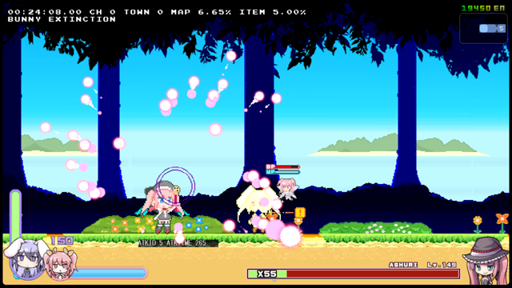

赤色（ピンク色）の弾をばらまく。 
HP 割合が 66% 未満の場合は 50% の確率でイオンリング、横レーザー、赤色弾幕のいずれかの行動が当確率で選ばれ変化する。 
行動変化で赤色弾幕が選ばれた場合は数フレーム後に再び行動変化の抽選処理が行われる。 
実際の選出確率はイオンリング 20% 、横レーザー 20% 、赤色弾幕 60% となる。 
行動パターンのリストではこの再抽選も考慮した確率を載せている（他の行動変化を持つ行動も同様）。 

#### 行動後パターン
杖降ろし (ATKID : 7) 確定 
 
 
 

### 水色弾幕 (ATKID : 6)

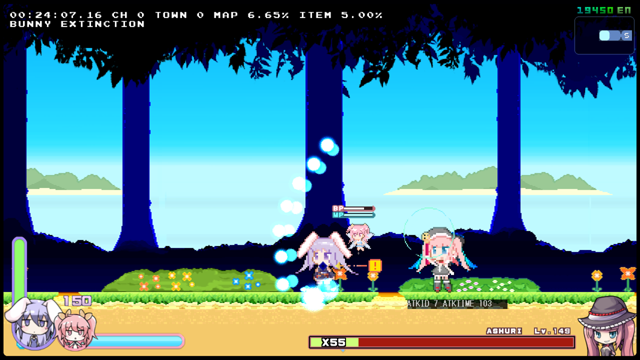

水色の弾を上から扇状に放つ。 
半端な位置で撃たれるとかなり辛い行動。 
至近距離でタイミングよくジャンプすれば簡単に回避できるが、ごく一部を除いて赤色弾幕とのランダム選出なのでほぼ運任せとなる。 
HP割合が 80% 未満の場合は 50% の確率で横レーザーに変化する。 

#### 行動後パターン
杖降ろし (ATKID : 7) 確定 
 
 
 

### 杖降ろし (ATKID : 7)
杖を降ろすだけの行動。 
この行動を取った累計回数によって次の行動が決定する。 

#### 行動後パターン
| 回数 | HP 割合 | 確率 | 行動 |
| :---: | :---: | ---: | :---: |
| 3 | `N/A` | 100.00% | 縦レーザー |
| 3 を除く 3 の倍数 | `N/A` | 100.00% | ジャンプ移動 |
| 5 の倍数 | `HP >= 80%` | 66.66% 16.66% 16.66% | 歩行1 赤色弾幕 水色弾幕 |
| 5 の倍数 | `80% > HP >= 66%` | 66.66% 16.66% 8.33% 8.33% | 歩行1 赤色弾幕 水色弾幕 横レーザー|
| 5 の倍数 | `66% > HP` | 66.66% 11.66% 10.00% 8.33% 3.33% | 歩行1 横レーザー 赤色弾幕 水色弾幕 イオンリング |
| その他 | `N/A` | 33.33% 33.33% 33.33% | ジャンプ 歩行1 歩行2 |

&nbsp; 
 
 

### 縦レーザー (ATKID : 27)

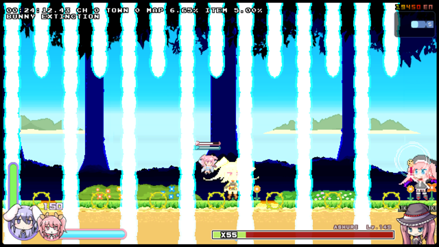

自身から近い方の画面端に向かってジャンプし、上からレーザーを射出してくる。 
裏取りができれば非常に簡単な攻撃。 

#### 行動後パターン

杖降ろし (ATKID : 7) 確定 
 
 
 

### ジャンプ移動 (ATKID : 8)

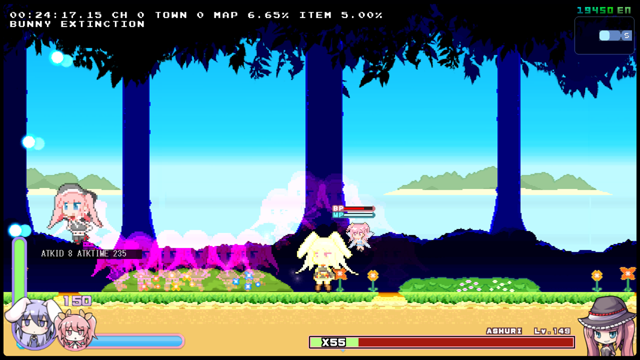

行動開始直後にプレイヤーの方向を確認し、ジャンプしつつ移動する。 
画面端にいる状態でこの行動に移る、またはこの行動中にノックバックで画面端に追いやるとそのまま画面端に向かって歩くようになる。 
正しく対応できれば最もスキが大きく次の行動も読みやすい攻撃。 
HP 割合が 50% 超過、 50% 以下用でそれぞれ個別に行動が用意されている。 
行動パターンのカウンタも個別に用意されている。 

#### 行動後パターン

##### HP 割合 50% 超過
| カウンタ | HP 割合 | 確率 | 行動 |
| :---: | :---: | ---: | :---: |
| 1 | `N/A` | 100% | 突進星屑 |
| 2 | `HP >= 66%` | 33.33% 33.33% 33.33% | イオンリング 横レーザー 赤色弾幕 |
| 2 | `66% > HP` | 40.00% 40.00% 20.00% | イオンリング 横レーザー 赤色弾幕 |
| 3 | `HP >= 80%` | 100.00% | 水色弾幕 |
| 3 | `80% > HP` | 50.00% 50.00% | 水色弾幕 横レーザー |
| 4 | `HP > 66%` | 100.00% | 突進星屑 |
| 4 | `HP == 66%` | 33.33% 33.33% 33.33% | イオンリング 横レーザー 赤色弾幕 |
| 4 | `66% > HP` | 40.00% 40.00% 20.00% | イオンリング 横レーザー 赤色弾幕 |
| 5 | `N/A` | 100.00% | 突進星屑 |

+ 5 の次は 1 の行動に戻るが、カウンタが 6 の倍数の場合はL字屈折レーザーが割り込む 

##### HP 割合 50% 以下
3 種類のカウンタが同時に回っていて、優先度は C > B > A
| カウンタ | カウンタ A 行動 | カウンタ B 行動 | カウンタ C 行動 |
| :---: | :---: | :---: | :---: |
| 1 | 横レーザー | 突進星屑 | カットイン攻撃 |
| 2 | 縦レーザー | | 縦レーザー |
| 3 | 50.00% 水色弾幕 50.00% 横レーザー | | |
| 4 | L字屈折レーザー | | |
| 5 | イオンリング | | |
| 6 | 40.00% イオンリング 40.00% 横レーザー 20.00% 赤色弾幕 | | |
| 7 | 突進星屑 | ※ 6 の次は 1 の行動に戻る | |
| 8 | ※ 7 の次は 1 の行動に戻る | | 縦レーザー |
| 9 ~ 14 | | | |
| 15| | | ※ 14 の次は 1 の行動に戻る |

###### 30 までの行動パターンまとめ
| カウンタ | 確率 | 行動 |
| :---: | ---:| :---: |
| 1 | 100.00% | カットイン攻撃 |
| 2 | 100.00% | 縦レーザー |
| 3 | 50.00% 50.00% | 水色弾幕 横レーザー |
| 4 | 100.00% | L字屈折レーザー |
| 5 | 100.00% | イオンリング |
| 6 | 40.00% 20.00% 20.00% | イオンリング 横レーザー 赤色弾幕 |
| 7 | 100.00% | 突進星屑 |
| 8 | 100.00% | 縦レーザー |
| 9 | 100.00% | 縦レーザー |
| 10 | 50.00% 50.00% | 水色弾幕 横レーザー |
| 11 | 100.00% | L字屈折レーザー |
| 12 | 100.00% | イオンリング |
| 13 | 100.00% | 突進星屑 |
| 14 | 100.00% | 突進星屑 |
| 15 | 100.00% | カットイン攻撃 |
| 16 | 100.00% | 縦レーザー |
| 17 | 50.00% 50.00% | 水色弾幕 横レーザー |
| 18 | 100.00% | L字屈折レーザー |
| 19 | 100.00% | 突進星屑 |
| 20 | 40.00% 20.00% 20.00% | イオンリング 横レーザー 赤色弾幕 |
| 21 | 100.00% | 突進星屑 |
| 22 | 100.00% | 縦レーザー |
| 23 | 100.00% | 縦レーザー |
| 24 | 50.00% 50.00% | 水色弾幕 横レーザー |
| 25 | 100.00% | 突進星屑 |
| 26 | 100.00% | イオンリング |
| 27 | 40.00% 20.00% 20.00% | イオンリング 横レーザー 赤色弾幕 |
| 28 | 100.00% | 突進星屑 |
| 29 | 100.00% | カットイン攻撃 |
| 30 | 100.00% | 縦レーザー |

&nbsp; 
 
 

### 突進星屑 (ATKID : 12)
突進攻撃 (ATKID : 52) と追尾星屑 (ATKID : 30) を選ぶための中間行動。 
この行動の累計回数が奇数なら突進攻撃 (ATKID : 52) 、偶数なら追尾星屑 (ATKID : 30) へ即座に移る。 
ただしジャンプ移動 (ATKID : 8) が持つ HP 50% 未満の行動カウンタ A と 7 の剰余が 6 の時に場合、縦レーザー (ATKID : 27) が割り込む。 

#### 行動後パターン
本文参照 
 
 
 

### 突進攻撃 (ATKID : 52 → 53)

杖に飛び乗り、画面を 4 回往復する。 
着地する方向は最初の飛んだ方向と逆方向であることを意識すると楽。 
難易度が高いほど終了時の位置がずれる。 
X-BUNNY になると位置が画面外まで飛び出てしまい、往復の繰り返しが優先されて突進攻撃が無限ループする。 

#### 行動後パターン
ジャンプ移動 (ATKID : 8) 確定 
 
 
 

### 追尾星屑 (ATKID : 30)

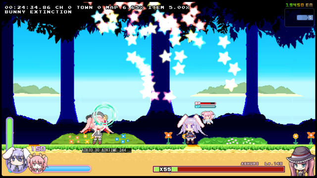

35 フレームごと 星屑を 6 セット発射する。 
1 セットで放つ星屑の数は難易度によって決定される。 

| 難易度 | 星屑の数 |
| :---: | :---: |
| NOVICE 以下 | 1 |
| NORMAL | 3 |
| HARD | 5 |
| HELL | 7 |
| BEX 以上 | 9 |

初速度 `(3.3 ~ 10.0) + 16.5` の Way 弾として発射されている。 
Way ごとの間隔は 6 度、中心の角度は 200 ～ 270 度 または 270 ～ 340 度 となっている。 

#### 行動後パターン
杖降ろし (ATKID : 7) 確定 
 
 
 

### 横レーザー (ATKID : 4)

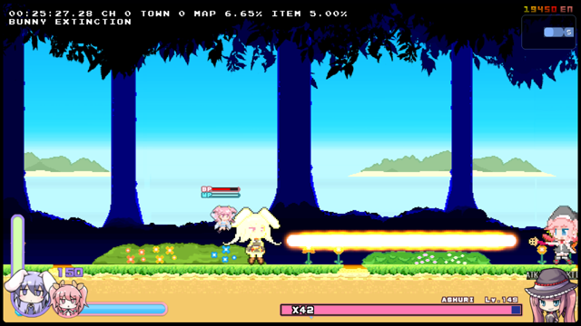

横方向にオレンジ色のレーザーを放つ。 
スキが大きく、次の行動も読みやすい。 

#### 行動後パターン
突進星屑 (ATKID : 12) 確定 
 
 
 

### L 字屈折レーザー (ATKID : 11 → 20)

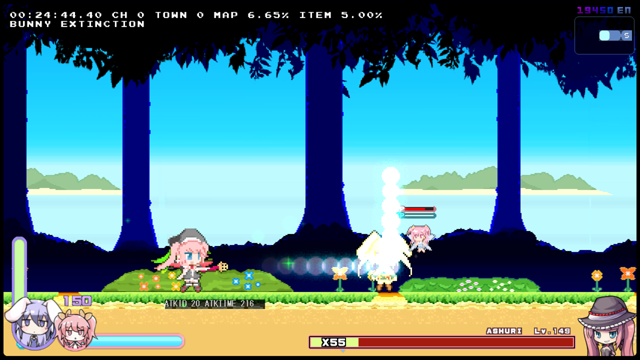

画面端に寄せれば当たらない。 
難易度 HELL 以上の場合では 50% の確率でレーザーを再度放ち、その後も同じ抽選処理が入る。 
わたしは 10 回連続 (1/512) で撃たれて死んだことがあります v(^-^) ​ 

#### 行動後パターン
突進星屑 (ATKID : 12) 確定 
 
 
 

### イオンリング (ATKID : 3)

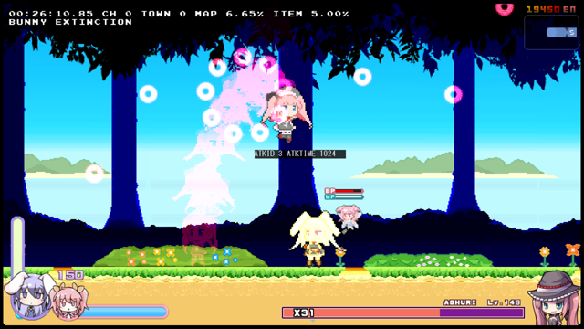

+ イオンリング = [グラディウスのモアイが口から吐き出す弾](https://youtu.be/HeKNaygK62Q?t=278)。これにそっくり。 

やや低いジャンプをして `(4 + 難易度)` Way 全方位のイオンリングを放つ。 
ベースとなる角度は `X座標 * 5 + 90` (小数点切り捨て) 。 
画面端に留まることで接触ダメージの回避はできるが、イオンリングが直撃する可能性はある。 
画面端で直撃する理由は座標の飽和処理より前に角度決定が行われているのが原因？ [未検証] 
着地後はジャンプ (ATKID : 0) に移り、HP割合次第でこの行動が無限ループする。 

#### 行動後パターン
ジャンプ (ATKID : 0) 確定 
 
 
 

### カットイン (ATKID : 14 → 13)

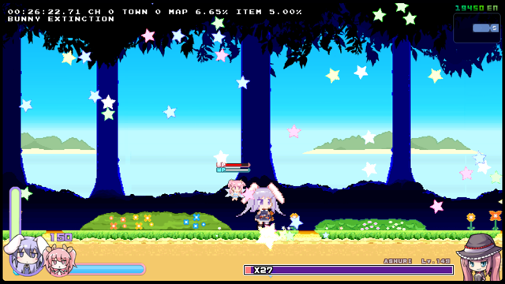

ジャンプ中の仕様はジャンプ (ATKID : 0) と同じ。 
`(18 - 難易度)` 個に 1 個、基礎威力が 3.33 倍の弾が発生する。 
CASUAL では 18 個に 1 個、 BEX では 13 個に 1 個、 X-BUNNY では 8 個に 1 個発生する。 
着地後にジャンプ (ATKID : 0) に移るが、ジャンプ高度が初期化されていないので非常に高いジャンプを 1 回して次の行動に移る。 

#### 行動後パターン
ジャンプ (ATKID : 0) 確定 
 
 
 

### 魔法陣レーザー (ATKID : 777 → 877)

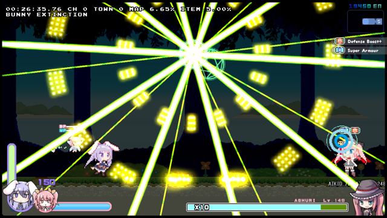

Defense Boost+ が発動し、次の行動が確定した後に割り込む形で開始する。 
この行動は 1 度しか起こらない。 
以下の要件をすべて満たすとこの行動が割り込む。 

+ ATKTIME ( `Entity[0x67C]` )  が 101
  + 歩行 2 では ATKTIME の初期化が起こらないので割り込まれない。
+ アニメーション ( `Entity[0x664]` ) がニュートラル・歩行・ジャンプのいずれか
+ 空中タイマー ( `Entity[0x630]` ) が 0
  + 地面に触れている状態でも 0 で安定していない。
    + 稀にこの行動に移るのが遅いのはこれが原因か？
+ カットイン発動フラグ ( `Entity[0x498]` ) が 1 以上
  + カットイン攻撃が済んでない場合はそちらが優先される。

#### 行動後パターン
ジャンプ移動 (ATKID : 8) 確定 
 
 
 

## Lilith's Gift 使用時の行動パターン変化タイミング

| HP 割合 | 行動変化 | CASUAL | NORMAL | BEX | IMP |
| ---: | :---: | ---: | ---: | ---: | ---: |
| 100.00% | 初期状態 | 30.000 | 40.000 | 55.000 | 65.000 |
| 80.00% | 水色弾幕 変化 | 24.000 | 32.000 | 44.000 | 52.000 |
| 66.00% | 赤色弾幕 変化 | 19.800 | 26.400 | 36.300 | 42.900 |
| 60.00% | 永続イオンリング 開始 | 18.000 | 24.000 | 33.000 | 39.000 |
| 55.00% | 永続イオンリング 終了 イオンリング 着地後 L字確定 開始 | 16.500 | 22.000 | 30.250 | 35.750 |
| 50.00% | イオンリング着地後 L字確定 終了 ジャンプ移動パターン変化 | 15.000 | 20.000 | 27.500 | 32.500 |
| 40.00% | イオンリング着地後 L字確定 開始 | 12.000 | 16.000 | 22.000 | 26.000 |
| 32.50% | イオンリング着地後 L字確定 終了 | 9.750 | 13.000 | 17.875 | 21.125 |
| 20.00% | Defense Boost+ 付与 | 6.000 | 8.000 | 11.000 | 13.000 |
| 15.00% | バフ付与 | 4.500 | 6.000 | 8.250 | 9.750 |

+ ゲージ残り本数が x33 でゲージが半分削れている場合の本数は 33.5 本となる。 
+ Lilith's Gift のゲージ 1本あたりの HP 量は整数型で計算されているため、実際に表示されるゲージ量はわずかに大きくなることがある。 
  + 例えば初期 HP が 12,200 、ゲージ本数が 55 の場合は `12200 / int(12200 / 55) ≈ 55.2` が最大となる。
   
   
   

## その他 雑多な攻略情報
+ Carrot Bomb のような戦闘で使用しないアイテムを装備しない事で Lv ペナルティを 0.4 から 0.1125 に減らすことができる。
+ Starting Forest の UPRPRC イベントを終えるとアイテム収集率 5.00% 以下のモードが内部的に解禁される。
  + これによってアイテム収集率を 5.00% 以下に保つことで敵の HP を 0.825 倍にすることができる。
+ Piko Hammer を装備しないことで HP を大きく減らすことができる。ただしメインの火力と硬直手段も失うので活用はまずできない。
  + アイテム収集率が 5.00% 以下の場合は HP が `0.82 - (難易度 * 0.02)` 倍、 
    アイテム収集率が 5.00% 超過の場合は HP が `0.91 - (難易度 * 0.01)` 倍となる。
  + この効果は上のアイテム収集率 5.00% 以下補正と重複する。
+ 敵の HP ゲージが伸び切った後にバッジを装備することで PP 消費によって増える HP を先に擦り切る事ができる。
  + 現在 HP が減ってるわけではなく、最大 HP 増加によるゲージ変動なので使わないバッジを装備しても無意味。
  + 被ダメージは敵の表示 Lv から計算されているので減らない。
+ Starting Forest 南東で Downdrill Semisolid Clip を使って抜けることで Golden Riverbank のアイテムを先取りできる。
  + UPRPRC が放つ弾を使ってDamage Boost することで Carrot Bomb 無しでも侵入可能。
    + 帰りは Whirl Bonk で来た道を戻るか、ワープストーンを使う (要 Ribbon イベント) 。
+ Golden Riverbank 内の有用そうなアイテム
  + Attack Up 2個
    + 1 個で Erina の与ダメージ +10% 、 Ribbon の与ダメージ +5% 。ゲーム内の説明は誤り。
    + 1 個で Toxic Strike のスリップダメージが 3.2 増加 (ボス戦)。ただしこれは Attack Up 1 個ごとに 0.16 ずつ増加量が減り、0.32 が増加量の下限となる。
  + ATK Grow
    + ゲーム開始直後は与ダメージが小さいので 1 か 2 のダメージ増加でも効果が大きい。
    + 5 PP 消費。このため Toxic Strike との併用には Pack Up も必要。

 
 

## 解析に関する情報など
+ Ashuri のメインルーチン開始位置アドレスは `rabiribi.exe+0x11E7F0` 。
  + Ashuri 1, Ashuri 2, Ashuri 1 Special すべての種類がこのルーチンで処理されている。
  + 行動処理も大部分を共有している。この記事では Ashuri 1 で実行される部分のみを抜粋し、他は省略した。

### ATKID リスト
+ 「用」と記述されているものは他のモードでも実行可能。
+ 「用」と記述されていないものは他のモードだと処理そのものが走らない。

| ATKID | Address | 行動 |
| ---: | ----: | :---- |
| -2 | `0x12331D` | 停止 → 歩行 |
| -1 | `0x1230F6` | 歩行 |
| 0 | `0x122F45` | ジャンプ |
| 1 | `0x1233C5` | 未使用？ 歩行？ |
| 2 | `0x1234C7` | 未使用 キャロットボム投下 |
| 3 | `0x1235D8` | イオンリング |
| 4 | `0x1218B1` | 横レーザー |
| 5 | `0x1210AE` | 赤色弾幕 |
| 6 | `0x121485` | 水色弾幕 |
| 7 | `0x122054` | 杖降ろし |
| 8 | `0x12224B` | ジャンプ歩行 |
| 9 | `0x120E41` | Ashuri 2 用 全方位イオンリング |
| 10 | `0x120F9B` | Ashuri 2 用 イオンリング発射 |
| 11 | `0x11EB96` | Ashuri 1 L字屈折レーザー  Ashuri 2 ランダム縦レーザー |
| 12 | `0x1209BC` | 突進追尾 |
| 13 | `0x1228ED` | Ashuri 1 用 カットイン 攻撃中 |
| 14 | `0x122E43` | Ashuri 1 用 カットイン ジャンプ |
| 20 | `0x121A9A` | L字屈折レーザー |
| 27 | `0x120A9A` | 縦レーザー |
| 30 | `0x1212B6` | 追尾星屑 |
| 50 - 51 | `0x11E960` | Ashuri 1 ATKID 3 - 5 ランダム選出 |
| 50 | `0x11EEDC` | Ashuri 2 交差星屑 |
| 51 | `0x11F053` | Ashuri 2 ジャンプ + イオンリング |
| 52 | `0x11F37D` | 突進 継続中 |
| 53 | `0x11F68D` | Ashuri 1 突進 着地 |
| 54 | `0x11FDCF` | Ashuri 2 突進 + 爆撃 |
| 54 - 65 | `0x11E960` | Ashuri 1 ATKID 3 - 5 ランダム選出 |
| 60 | `0x120981` | Ashuri 2 突進 画面外待機時間？ |
| 61 | `0x1216F0` | Ashuri 2 L字屈折レーザー |
| 62 | `0x121CBF` | Ashuri 2 赤レーザー |
| 777 | `0x1238D5` | 魔法陣レーザー |
| 800 | `0x124C4C` | Special 用 魔法陣 赤青ワインダー |
| 801 | `0x124923` | Special 用 画面上部ピンク弾 |
| 802 | `0x124494` | Special 用 画面四隅低速弾 |
| 803 | `0x124167` | Special 用 赤緑全方位弾乱発 |
| 804 | `0x123BC0` | Special 用 レーザー |
| 877 | `0x1252B8` | 魔法陣レーザー 終了 |
| 987 | `0x124E92` | Ashuri 2 用 カットイン攻撃 |
| その他 | `0x1252F0` | Ashuri メインルーチン終了 |

&nbsp; 
 
 

## 最後に

Bunny Hell の場合、結局はジャンプなどの運行動で攻撃計画が破綻するクソゲーです。 
いくら取り組んでも安定することはおそらく一生ありません。 
 ( これは Bunny Hell の全ての敵に言えそう。私が Bunny Hell を好んでプレイしない一番の理由です ) 
[Map transition RCS](https://wcko87.github.io/rabi-ribi-guides/map-transition-rcs) を使って飛ばすことを強く推奨します。 

