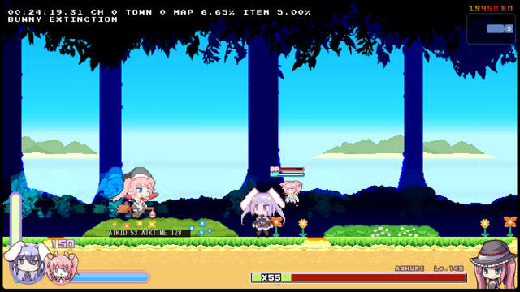

# Ashuri 1 攻略情報

## 諸注意

この情報は Rabi-Ribi ver 1.99t を逆アセンブルして得た情報を元に執筆しています。 
コードに対しての誤解や雑な検証が原因で誤った情報が混ざってる可能性があります。 
 
ここでは「超過」という単語を「未満」の対義語として使用しています。 
フレーム数は敵から見たもので、プレイヤーからはより少ない値となります。 
 
 
 
## 行動速度増加量
| 難易度     |   ザコ敵 |    ボス | ボス + Speed Up |
| :---: | ---: | ---: | ---: |
| CASUAL     |   +0.00% |  +0.00% |         +16.67% |
| NOVICE     |   +0.00% |  +0.00% |         +16.67% |
| NORMAL     |   +5.00% |  +5.00% |         +16.67% |
| HARD       |   +8.33% |  +8.33% |         +25.00% |
| HELL       |  +12.50% | +12.50% |         +33.33% |
| BEX        |  +16.67% | +16.67% |         +33.33% |
| UNKNOWN    |  +25.00% | +25.00% |         +33.33% |
| IMPOSSIBLE | +100.00% | +50.00% |         +33.33% |
| X-BUNNY    | +100.00% | +50.00% |         +33.33% |

※ IMPOSSIBLE 以上の難易度になると Speed Up バフが持つリミッターによって逆に行動速度が遅くなる。 
 
上記に加えて Bunny Heaven ではプレイヤーに +50% 、 Bunny Hell では全ての敵に +133.33% の行動速度増加が追加で行われる。 
例えば BEX + Bunny Hell ( およそ 250% ) では CASUAL ( 100% ) の約 2.5 倍の速度で動くこととなる。 
 
 
## 行動パターン
### ジャンプ (ATKID : 0)

最初に確定で使用してくる攻撃。 
ジャンプの高度と内部のカウンタは連動しているため、高度が高いほど次の着地で攻撃態勢になる可能性が高い。 

#### ジャンプ回数の確率
| 回数 | 確率 | 確率 (%) |
| :---: | ---: | ---: |
| 2 回 | 18/27 | 66.666% |
| 3 回 | 8/27 | 29.629% |
| 4 回 | 1/27 |  3.703% |

#### ジャンプの高さとその後の行動確率

##### **高さ 1**

攻撃 : 33.33% ジャンプ : 66.66%

**高さ 2**

攻撃 : 66.66% ジャンプ : 33.33%

**高さ 3**

攻撃 : **100.00%**

#### 行動後パターン

| HP 割合 | 確率 (%) | 行動 |
| :---: | ---: | :---: |
| `HP >= 80%` | 50.00%   50.00% | 赤色弾幕   水色弾幕 |
| `80% > HP >= 66%` | 50.00%   25.00%   25.00% | 赤色弾幕   水色弾幕   横レーザー |
| `66% > HP >= 60%` | 35.00%   30.00%   25.00%   10.00% | 横レーザー   赤色弾幕   水色弾幕   イオンリング |
| `60% > HP > 55%` | 100.00% | イオンリング |
| `55% >= HP >= 50%` | 50.00%   50.00% | L字屈折レーザー   イオンリング |
| `50% > HP >= 40%` | 50.00%   17.50%   15.00%   12.50%   5.00% | L字屈折レーザー   横レーザー   赤色弾幕   水色弾幕   イオンリング |
| `40% > HP > 32.5%` | 50.00%   50.00% | L字屈折レーザー   イオンリング |
| `32.5% >= HP` | 50.00%   17.50%   15.00%   12.50%   5.00% | L字屈折レーザー   横レーザー   赤色弾幕   水色弾幕   イオンリング |
 
 
 
### 歩行1 (ATKID : -1)

すぐに移動を開始する。 
移動から攻撃まで約 100 フレームの猶予があるので攻撃しやすい。 

#### 行動後パターン

ジャンプ (ATKID : 0) と同じ 
 
 
 
### 歩行2 (ATKID : -2)

問題の行動。 
行動開始から約 40 フレーム後から移動を開始する。 
歩行１より移動速度がやや早く、歩行から次の攻撃までの猶予も約 50 フレームしかない。 
処理にバグがあり、次の行動を突発的に発動する。 
水色弾幕が選出されると不発に終わり、赤色弾幕は突発的に発射してくる。 
杖を降ろしてから歩行開始までにラグがあると感じた時はこの行動を警戒すべき。 
 
歩行1とは違い、この行動からイオンリングへ繋がる事は無い。 

#### 行動後パターン
| HP 割合 | 確率 (%) | 行動 |
| :---: | ---: | :---: |
| `HP > 55%` | 50.00%   50.00% | 赤色弾幕 (突発)   水色弾幕 (不発) |
| `55% >= HP` | 50.00%   25.00%   25.00% | L字屈折レーザー   赤色弾幕 (突発)   水色弾幕 (不発)|
 
 
 
### イオンリング  (ATKID : 3)

やや低いジャンプをして `(4 + 難易度)` Way 全方位のイオンリング (◎型の弾) を放つ。 
ベースとなる角度は `X座標 * 5 + 90` (小数点切り捨て) 。 
画面端に留まることで接触ダメージの回避はできるが、イオンリングが直撃する可能性はある。 
画面端で直撃する理由は座標の飽和処理より前に角度決定が行われているのが原因？ [未検証] 
着地後はジャンプ (ATKID : 0) に移り、HP割合次第でこの行動が無限ループする。 

#### 行動後パターン
ジャンプ (ATKID : 0) 確定 
 
 
 
### 横レーザー (ATKID : 4)

横方向にオレンジ色のレーザーを放つ。 
スキが大きく、次の行動も読みやすい。 

#### 行動後パターン
突進星屑 (ATKID : 12) 確定 
 
 
 
### 赤色弾幕 (ATKID : 5)

赤色（ピンク色）の弾をばらまく。 
HP割合が 66% 未満の場合は 50% の確率でイオンリング、横レーザー、赤色弾幕のいずれかの行動が当確率で選ばれ変化する。 
行動変化で赤色弾幕が選ばれた場合は数フレーム後に再び行動変化の抽選処理が行われる。 
実際の選出確率はイオンリング 20% 、横レーザー 20% 、赤色弾幕 60% となる。 
行動パターンのリストではこの再抽選も考慮した確率を載せている（他の行動変化を持つ行動も同様）。 

#### 行動後パターン
杖降ろし (ATKID : 7) 確定 
 
 
 
### 水色弾幕 (ATKID : 6)

水色の弾を上から扇状に放つ。 
半端な位置で撃たれるとかなり辛い行動。 
至近距離でタイミングよくジャンプすれば簡単に回避できるが、ごく一部を除いて赤色弾幕とのランダム選出なのでほぼ運任せとなる。 
HP割合が 80% 未満の場合は 50% の確率で横レーザーに変化する。 

#### 行動後パターン
杖降ろし (ATKID : 7) 確定 
 
 
 
### 杖降ろし (ATKID : 7)
杖を降ろすだけの行動。 
この行動を取った累計回数によって次の行動が決定する。 

#### 行動後パターン
| 回数 | HP 割合 | 確率 (%) | 行動 |
| :---: | :---: | ---: | :---: |
| 3 | `N/A` | 100.00% | 縦レーザー |
| 3 を除く 3 の倍数 | `N/A` | 100.00% | ジャンプ移動 |
| 5 の倍数 | `HP >= 80%` | 66.66%   16.66%   16.66% | 歩行1   赤色弾幕   水色弾幕 |
| 5 の倍数 | `80% > HP >= 66%` | 66.66%   16.66%   8.33%   8.33% | 歩行1   赤色弾幕   水色弾幕   横レーザー|
| 5 の倍数 | `66% > HP` | 66.66%   11.66%   10.00%   8.33%   3.33% | 歩行1   横レーザー   赤色弾幕   水色弾幕   イオンリング |
| その他 | `N/A` | 33.33%   33.33%   33.33% | ジャンプ   歩行1   歩行2 |
 
 
 
### ジャンプ移動 (ATKID : 8)

ジャンプしつつ歩いて向かってくる。 
画面端にいる状態でこの行動に移ると画面端に向かって歩く。 
正しく対応できれば最もスキが大きく次の行動も読みやすい攻撃。 
HP 割合が 50% 超過、 50% 以下用でそれぞれ個別に行動が用意されている。 
行動パターンのカウンタも個別に用意されている。 

#### 行動後パターン

##### HP 割合 50% 超過
| カウンタ | HP 割合 | 確率 (%) | 行動 |
| :---: | :---: | ---: | :---: |
| 1 | `N/A` | 100% | 突進星屑 |
| 2 | `HP >= 66%` | 33.33%   33.33%   33.33% | イオンリング   横レーザー   赤色弾幕 |
| 2 | `66% > HP` | 40.00%   40.00%   20.00% | イオンリング   横レーザー   赤色弾幕 |
| 3 | `HP >= 80%` | 100.00% | 水色弾幕 |
| 3 | `80% > HP` | 50.00%   50.00% | 水色弾幕   横レーザー |
| 4 | `HP > 66%` | 100.00% | 突進星屑 |
| 4 | `HP == 66%` | 33.33%   33.33%   33.33% | イオンリング   横レーザー   赤色弾幕 |
| 4 | `66% > HP` | 40.00%   40.00%   20.00% | イオンリング   横レーザー   赤色弾幕 |
| 5 | `N/A` | 100.00% | 突進星屑 |

※ : 5 の次は 1 の行動に戻るが、カウンタが 6 の倍数の場合はL字屈折レーザーが割り込む 

##### HP 割合 50% 以下
3 種類のカウンタが同時に回っていて、優先度は C > B > A
| カウンタ | カウンタ A 行動 | カウンタ B 行動 | カウンタ C 行動 |
| :---: | :---: | :---: | :---: |
| 1 | 横レーザー | 突進星屑 | カットイン攻撃 |
| 2 | 縦レーザー | | 縦レーザー |
| 3 | 50.00% 水色弾幕   50.00% 横レーザー | | |
| 4 | L字屈折レーザー | | |
| 5 | イオンリング | | |
| 6 | 40.00% イオンリング   40.00% 横レーザー   20.00% 赤色弾幕 | | |
| 7 | 突進星屑 | ※ 6 の次は 1 の行動に戻る | |
| 8 | ※ 7 の次は 1 の行動に戻る | | 縦レーザー |
| 9 ~ 14 | | | |
| 15| | | ※ 14 の次は 1 の行動に戻る |

###### 30 までの行動パターンまとめ
| カウンタ | 確率 (%) | 行動 |
| :---: | ---:| :---: |
| 1 | 100.00% | カットイン攻撃 |
| 2 | 100.00% | 縦レーザー |
| 3 | 50.00%   50.00% | 水色弾幕   横レーザー |
| 4 | 100.00% | L字屈折レーザー |
| 5 | 100.00% | イオンリング |
| 6 | 40.00%   20.00%   20.00% | イオンリング   横レーザー   赤色弾幕 |
| 7 | 100.00% | 突進星屑 |
| 8 | 100.00% | 縦レーザー |
| 9 | 100.00% | 縦レーザー |
| 10 | 50.00%   50.00% | 水色弾幕   横レーザー |
| 11 | 100.00% | L字屈折レーザー |
| 12 | 100.00% | イオンリング |
| 13 | 100.00% | 突進星屑 |
| 14 | 100.00% | 突進星屑 |
| 15 | 100.00% | カットイン攻撃 |
| 16 | 100.00% | 縦レーザー |
| 17 | 50.00%   50.00% | 水色弾幕   横レーザー |
| 18 | 100.00% | L字屈折レーザー |
| 19 | 100.00% | 突進星屑 |
| 20 | 40.00%   20.00%   20.00% | イオンリング   横レーザー   赤色弾幕 |
| 21 | 100.00% | 突進星屑 |
| 22 | 100.00% | 縦レーザー |
| 23 | 100.00% | 縦レーザー |
| 24 | 50.00%   50.00% | 水色弾幕   横レーザー |
| 25 | 100.00% | 突進星屑 |
| 26 | 100.00% | イオンリング |
| 27 | 40.00%   20.00%   20.00% | イオンリング   横レーザー   赤色弾幕 |
| 28 | 100.00% | 突進星屑 |
| 29 | 100.00% | カットイン攻撃 |
| 30 | 100.00% | 縦レーザー |
 
 
 
### L字屈折レーザー (ATKID : 11 → 20)

画面端に寄せれば当たらない。 
難易度 HELL 以上の場合では 50% の確率でレーザーを再度放ち、その後も同じ抽選処理が入る。 
わたしは 10 回連続 (1/512) で撃たれて死んだことがあります v(^-^) 

#### 行動後パターン
突進星屑 (ATKID: 12) 確定 
 
 
 
### 突進星屑 (ATKID : 12)
突進攻撃 (ATKID : 52) と追尾星屑 (ATKID : 30) を選ぶための中間行動。 
この行動の累計回数が奇数なら突進攻撃 (ATKID : 52) 、偶数なら追尾星屑 (ATKID : 30) へ即座に移る。 
ただしジャンプ移動 (ATKID : 8) が持つ HP 50% 未満の行動カウンタ A と 7 の剰余が 6 の時に場合、縦レーザー (ATKID : 27) が割り込む。 

#### 行動後パターン
本文参照 
 
 
 
### 突進攻撃 (ATKID : 52 → 53)

杖に飛び乗り、画面を 4 回往復する。 
着地する方向は最初の飛んだ方向と逆方向であることを意識すると楽。 
難易度が高いほど終了時の位置がずれる。 
X-BUNNY になると位置が画面外まで飛び出てしまい、往復の繰り返しが優先されて突進攻撃が無限ループする。 

#### 行動後パターン
ジャンプ移動 (ATKID: 8) 確定 
 
 
 
### 追尾星屑 (ATKID : 30)

[特に書くことが無い] 

#### 行動後パターン
杖降ろし (ATKID : 7) 確定 
 
 
 
### カットイン (ATKID : 14 → 13)

ジャンプ中の仕様はジャンプ (ATKID : 0) と同じ。 
`(18 - 難易度)` 個に 1 個、基礎威力が 3.33 倍の弾が発生する。 
CASUAL では 18 個に 1 個、 BEX では 13 個に 1 個、 X-BUNNY では 8 個に 1 個発生する。 
着地後にジャンプ (ATKID : 0) に移るが、ジャンプ高度が初期化されていないので非常に高いジャンプを 1 回して次の行動に移る。 

#### 行動後パターン
ジャンプ (ATKID : 0) 確定 
 
 
 
### 魔法陣レーザー (ATKID : 777 → 877)

Defense Boost+ が発動し、次の行動が確定した後に割り込む形で開始する。 
歩行 2 で発動させた場合はバグの影響で次の行動で割り込まれない。 
また、一部の行動では割り込まれない (どの行動が割り込まれないかは未検証) 。 

#### 行動後パターン
ジャンプ移動 (ATKID : 8) 確定 
 
 
 
## 最後に
Bunny Hell の場合、どれだけロジックを理解していようが結局はジャンプなどの運行動で攻撃計画が破綻するクソゲーです。 
いくら取り組んでも安定することはおそらく一生ありません。 
(これは Bunny Hell の全ての敵に言えそう。私が Bunny Hell をプレイしない一番の理由です) 
Map transition RCS を使って飛ばすことを強く推奨します。 